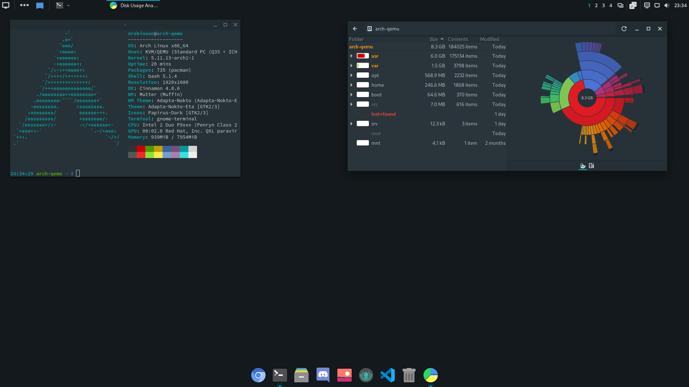

# arch-base


This repository is a post-installation setup script for Arch Linux that installs and configures my preferred packages to create a sleek and approachable desktop experience.
___


## Installation

On a newly installed Arch Linux environment clone this repository:

```bash
$ sudo pacman -S git
$ git clone https://github.com/nrobinson2000/arch-base
$ cd arch-base
```

Before running `install.sh`, read through the script and verify that you are content with the changes that it will make. To accept the script, uncomment the `DOTFILES_AGREE="true"` line in `install.sh`.

After accepting, run the script with the following:

```bash
$ ./install.sh
```

The script can take around 15-20 minutes to complete. After the script finishes, reboot your system and you should be presented with a graphical login window.
___

## Overview

```
DE: Cinnamon 4.8.6
WM: Mutter (Muffin)
WM Theme: Adapta-Nokto (Adapta-Nokto-Eta)
Theme: Adapta-Nokto-Eta [GTK2/3]
Icons: Papirus-Dark [GTK2/3]
Terminal: gnome-terminal
```
___

## TODO
- Make README more eyecatching
- Document shortcuts and tips
