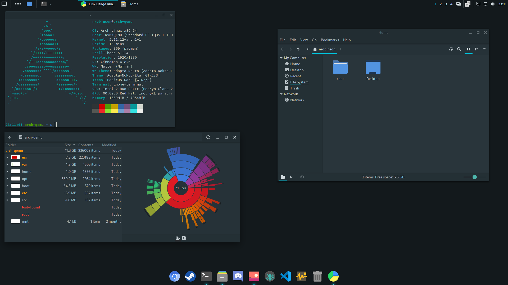

# arch-base


**Settings and configuration for my Arch Linux distribution.**

_This repository is a work in progress._

## Overview

```
DE: Cinnamon 4.8.6 
WM: Mutter (Muffin) 
WM Theme: Adapta-Nokto (Adapta-Nokto-Eta) 
Theme: Adapta-Nokto-Eta [GTK2/3] 
Icons: Papirus-Dark [GTK2/3] 
Terminal: gnome-terminal 
```

## TODO

- Create minimal package list(s) for replicating distribution.
- De-personalize and reorganize dconf settings.

___

## Installation

```bash
$ sudo pacman -S git
$ git clone https://github.com/nrobinson2000/arch-base
$ cd arch-base
```

Before running `install.sh`, read though the script and verify that you are content with the changes that it will make. To accept the script, uncomment the `DOTFILES_AGREE="true"` line in `install.sh`.

After accepting, run the script with the following:

```bash
$ ./install.sh
```

___

## Description of contents

### Packages
- `custom-packages` - A collection of PKGBUILD files for packages temporarily unavailable in official repositories or the AUR.
- `packages` - Lists of packages installed on the system. The `native` and `aur` files list explicitly installed packages.

### Scripts

- `install.sh` - Install the packages, settings, and customizations outlined in this repository.
- `refresh-files.sh` - Regenerate settings and customizations based on files currently in use by the system.

### Settings

- `overlay` - Customizations applied relative to the file-system root.
- `skel` - Settings applied relative to the current user's home directory.
- `dconf` - Settings applied to the current user's dconf database.

### Other
- `screenshots` - Various screenshots of the desktop environment.
- `steam` - Some useful settings for Valve's Steam.
- `systemd` - Miscellaneous settings for systemd.
