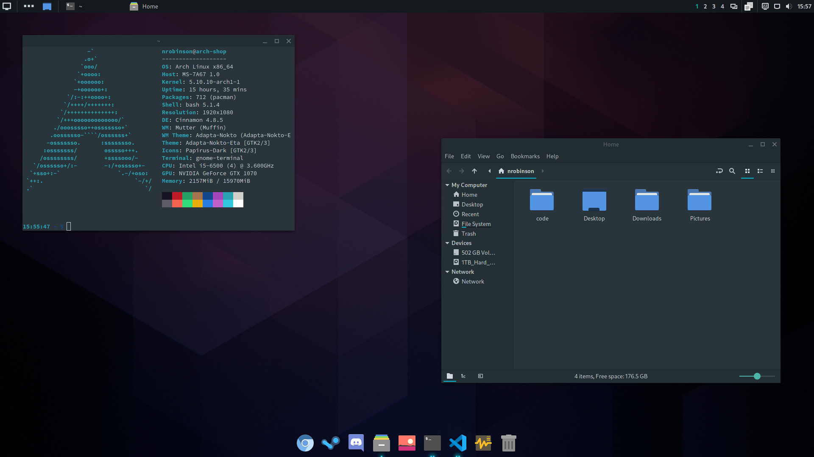

# nrobinson2000/dotfiles


_Settings and tweaks for my Arch Linux distribution._

## Overview

```
DE: Cinnamon 4.8.5 
WM: Mutter (Muffin) 
WM Theme: Adapta-Nokto (Adapta-Nokto-Eta) 
Theme: Adapta-Nokto-Eta [GTK2/3] 
Icons: Papirus-Dark [GTK2/3] 
Terminal: gnome-terminal 
```

## Installation

```
$ sudo install -D tweaks/etc /etc
$ sudo install -D tweaks/usr /usr
$ install -D skel "$HOME"
```